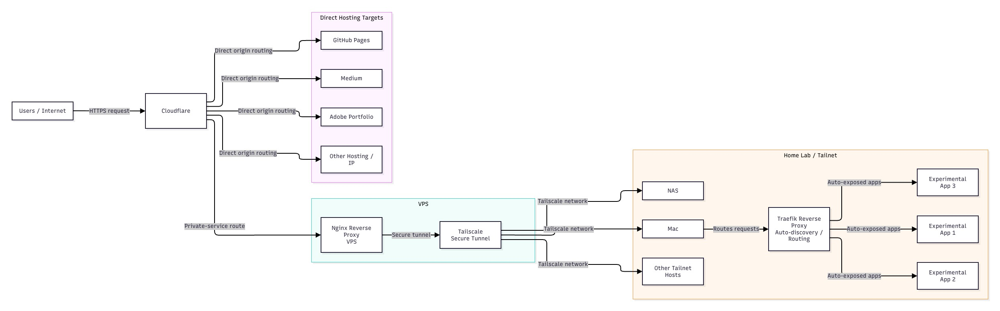

# HomeLab

__Purpose__ of this repo is for my personal home lab setup, and it can be accessed at https://labs.suriyaprakhash.com

## Installation

Start here: [debian/MAIN_START_HERE.md](debian/MAIN_START_HERE.md)

> [!WARNING]
> This is potentially very slow so install [tailscale directly on the vps](./debian/DOCKER_TAILSCALE.md#directly-on-the-vps)

